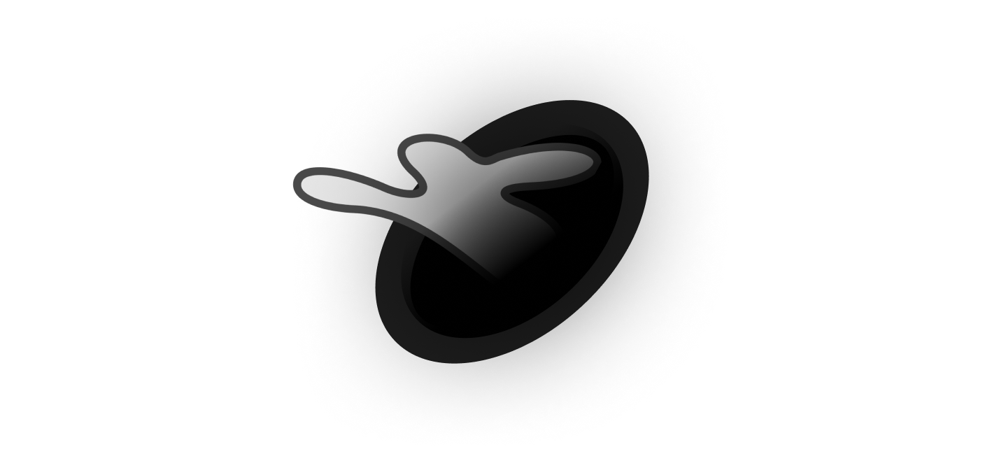

# Hole chat 🐇
A decentralized chat over [Freenet](https://freenetproject.org).

[See docs](https://docs.hole.horhik.xyz)

## Requirements❗❗❗
 [Freenet](https://freenetproject.org) running
 
# Installing 🚀
1. Clone [this](https://github.com/hole-chat/core) repo 
2. Launch core (`cargo run`)
3. Install and launch client (for example [rabbit-hole](https://github.com/hole-chat/rabbit-hole))

# TODO ☑️
- [x] Basic sending and receiving messages 💌
- [ ] Add RSA or NTRU encryption 🔐
- [ ] Write tests 🧪
- [ ] Make more vebose documentation 📚
- [ ] Create a hole-daemon 🖥
